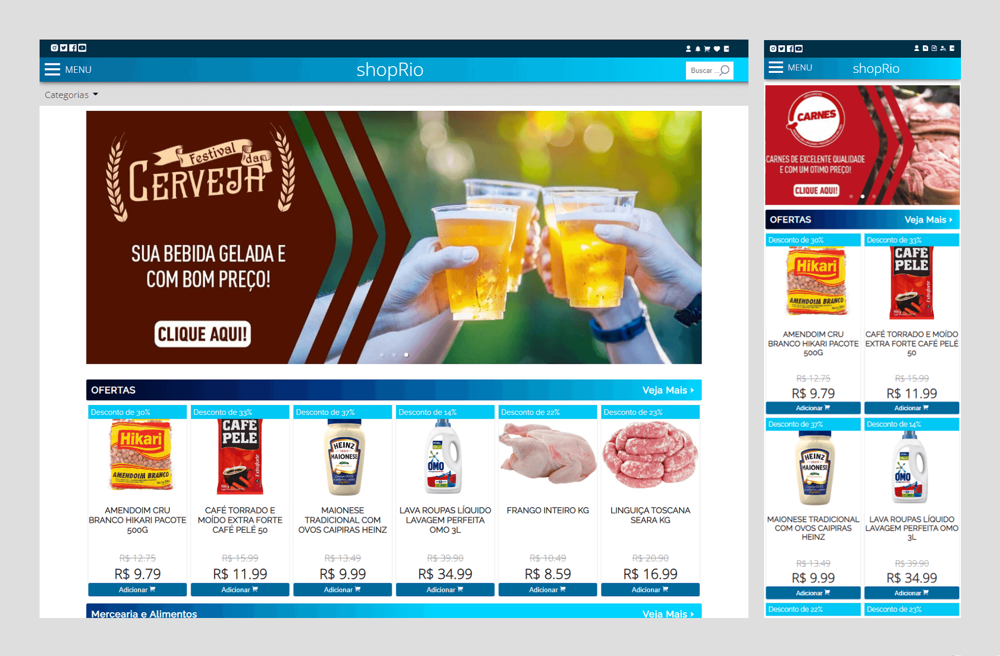

# E-commerce shopRio (Front-end)

Back-end corresponding: https://github.com/GiovanniLeite/shop-rio-back-end

## 📋 Presentation

An e-commerce platform tailored to serve a small market, facilitating online sales and delivery management. It's a full-stack project with React on the front-end and a Node.js-powered RESTful API connecting to a MySQL database. The platform includes Home, Login, Registration, Profile, Search, Product, Edit Product, and Edit Category pages. Key features encompass search by name or category, cart management (adding, removing, and modifying items), wish list functionality, pending orders, delivery confirmation, and various reporting capabilities. The project was finalized in May 2022.

## 🛠️ Front-end built with
- JavaScript
- React.js
- Redux
- HTML5
- CSS3
- Styled-components
- ESLint
- Prettier

## 📫 Contact

